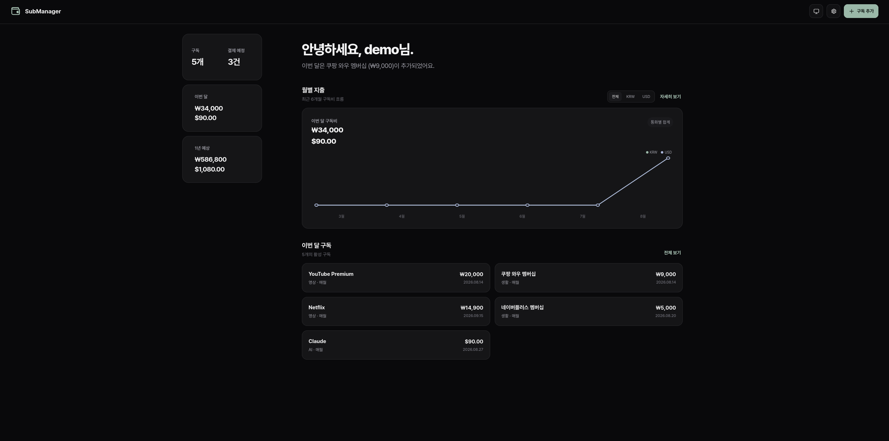

# SubManager

국내 환경에 맞는 경량 구독관리 대시보드.



## 주요 기능

- 활성 구독 수, 결제 예정 건수, 이번 달 구독비와 1년 예상 금액을 한눈에 확인
- 결제 예정 항목을 목록 또는 월간 캘린더로 확인하고 날짜별 상세 내역 조회
- 최근 6개월 지출 추이와 지난달 대비 증감, 구독별 월 예상 금액 제공
- KRW, USD 등 서로 다른 통화를 환산하거나 합산하지 않고 통화별로 집계
- 월간·연간 결제 주기, 무료 체험 종료일과 첫 결제일 관리
- 이번 달 결제만 건너뛰거나 다시 포함하고, 과거 기록을 유지한 채 구독 해지
- 금액이나 통화 변경 시 가격 이력을 보존하여 과거 월 합계를 당시 가격으로 계산
- 국내에서 자주 사용하는 서비스 템플릿 18개와 기본 결제수단 5개 제공
- 사용자 지정 서비스, 결제수단, 통화 코드 추가 및 관리
- Discord Webhook과 Telegram Bot을 통한 결제 예정 알림
- 비밀번호와 로그인 세션을 제외한 애플리케이션 데이터의 JSON 백업 및 복원
- 시스템·다크·라이트 테마와 반응형 모바일 레이아웃 지원
- 최초 한 번만 생성할 수 있는 단일 관리자 계정과 30일 로그인 세션
- 설정에서 로그인 이메일·비밀번호 변경과 현재 및 등록 세션 관리 지원

## 기술 스택

- Alpine Linux 3.22 + Go 1.24
- SQLite
- HTML, CSS, JS

## 시작하기

Docker을 사용하여 간편하게 시작할 수 있습니다. `docker-compose.yml`을 내려받고 최초 관리자 설정에 사용할 16자 이상의 임의 설정 키를 지정한 뒤 실행하세요.

```bash
export SETUP_TOKEN='충분히-길고-임의적인-최초-설정-키'
docker compose up -d
```

처음 접속하면 위 `SETUP_TOKEN` 값을 **최초 설정 키**에 입력합니다. 관리자 생성이 끝난 기존 데이터베이스에서는 이 환경 변수가 없어도 실행할 수 있습니다. 설정 키는 최초 관리자 생성에만 사용되며 데이터베이스에 저장되지 않습니다.

기본값은 `submanager-data` Docker 볼륨의 `/data/submanager.db`에 저장되며 필요한 경우 `submanager-data` 볼륨을 제거하고 호스트 맵핑으로 사용할 수 있습니다.

## 환경 변수

- PORT: `8080`
- DB_PATH: `./data/submanager.db`
- TZ: `Asia/Seoul`
- SETUP_TOKEN: 최초 설정 전 필수(16~128자), 관리자 생성 후 선택

## 사용 방법

### 구독 관리

상단의 **구독 추가**에서 기본 서비스 템플릿을 선택하거나 서비스를 직접 입력할 수 있습니다. 금액, 통화, 월간·연간 결제 주기, 결제일, 결제수단, 카테고리와 메모를 저장할 수 있으며 무료 체험도 별도로 관리합니다.

등록한 구독을 누르면 내용을 수정하거나 이번 달 결제만 건너뛸 수 있습니다. 구독을 해지해도 과거 결제 및 가격 변경 기록은 삭제되지 않습니다. 매월 29~31일처럼 존재하지 않는 날짜는 해당 월의 마지막 날로 자동 조정되며, 연간 구독은 지정한 결제 월을 기준으로 유지됩니다.

**결제 예정** 화면에서는 기존 목록과 월간 캘린더를 전환할 수 있습니다. 캘린더의 결제 표시가 있는 날짜를 누르면 서비스별 금액, 통화, 결제수단과 건너뛰기 상태를 확인할 수 있으며 서로 다른 통화는 합산하지 않습니다.

### 통화와 결제수단

기본 통화는 `KRW`, `USD`, `JPY`, `EUR`, `TRY`, `ARS`입니다. 설정의 **통화** 메뉴에서 영문 3자리 코드를 추가할 수 있습니다. 원·엔처럼 소수 단위가 없는 통화는 정수로, 달러·유로 등은 해당 통화의 소수 자릿수까지 입력하며 금액은 오차가 없도록 최소 단위 정수로 저장됩니다.

기본 결제수단은 신용(체크) 카드, 휴대폰결제, 계좌이체, 네이버페이, 카카오페이입니다. 사용자 지정 결제수단은 추가하거나 이름을 바꿀 수 있습니다. 이미 구독에서 사용한 사용자 지정 통화나 결제수단을 삭제하면 과거 기록 보존을 위해 화면에서만 보관 처리됩니다.

### 알림 연동

설정의 **연동** 메뉴에서 Discord Webhook 또는 Telegram Bot Token과 Chat ID를 입력하고 테스트 알림을 보낼 수 있습니다. **알림** 메뉴에서는 결제 예정 알림을 켜거나 끄고, 결제 며칠 전에 알릴지 0~30일 범위로 설정할 수 있습니다.

같은 날 결제 예정인 항목은 하나의 알림으로 묶어서 전송되며, 이번 결제를 건너뛴 구독은 제외됩니다. Telegram은 MarkdownV2 형식으로 전송됩니다. 예약 알림 작업은 서버 시작 시 한 번 실행된 뒤 6시간마다 확인합니다. 두 채널을 모두 설정하면 양쪽으로 전송됩니다.

### 데이터 백업과 복원

설정의 **데이터 관리**에서 JSON 파일을 내보내거나 가져올 수 있습니다. 백업에는 구독, 결제수단, 통화, 결제 건너뛰기, 가격 이력, 활동 이력과 애플리케이션 설정이 포함됩니다. Discord Webhook, Telegram Bot Token과 Chat ID는 기본적으로 제외되며, 내보내기 전에 **알림 연동 정보 포함**을 선택해 함께 저장할 수 있습니다.

> 백업에는 관리자 비밀번호와 로그인 세션이 포함되지 않습니다. 알림 연동 정보를 포함해 내보낸 백업은 민감한 정보로 취급하고 안전한 위치에 보관하세요.

가져오기는 현재 애플리케이션 데이터를 백업 내용으로 교체하지만 관리자 계정의 비밀번호와 활성 로그인 세션은 유지합니다. 작업은 하나의 트랜잭션으로 처리되므로 실패한 가져오기가 일부 데이터만 변경하지 않습니다.

## 로컬에서 실행하기

Go 1.24 이상과 CGO를 사용할 수 있는 C 컴파일러가 필요합니다. SQLite 드라이버가 CGO를 사용하므로 `CGO_ENABLED=0`으로 빌드할 수 없습니다.

```bash
go mod download
DB_PATH=./data/submanager.db PORT=8080 TZ=Asia/Seoul go run .
```

검증 명령은 다음과 같습니다.

```bash
gofmt -w main.go main_test.go
go test ./...
go vet ./...
go build ./...
docker compose config
```

## 데이터와 보안

- SQLite는 foreign key, WAL 모드, 5초 busy timeout과 단일 연결로 실행됩니다.
- 관리자 비밀번호는 bcrypt 해시로만 저장됩니다.
- 로그인 토큰은 무작위로 생성되며 SHA-256 해시만 데이터베이스에 저장됩니다.
- 로그인 실패는 IP와 계정 기준으로 제한되며 활성 로그인 세션은 최대 10개로 유지됩니다.
- Discord Webhook은 공식 HTTPS 주소만 허용하고 알림 오류에 연동 비밀정보를 포함하지 않습니다.
- 세션 쿠키는 `HttpOnly`, `SameSite=Strict`, 경로 `/`로 설정됩니다.
- `/health`는 인증 없이 컨테이너 상태 확인에 사용할 수 있습니다.
- 운영 환경에서는 HTTPS를 제공하는 리버스 프록시 뒤에서 실행하는 것을 권장합니다.

## 라이선스

[MIT License](LICENSE)
